# 医学线上辅助诊断系统 - 用户手册全文

【软件全称】医学线上辅助诊断系统
【版本号】V1.0
【开发的硬件环境】：CPU：2.3GHZ，4核；内存：8192M；硬盘：100G
【运行的硬件环境】：处理器：Intel i3；硬盘容量：1TB HDD ；显卡：集成显卡；内存容量：4G；
【开发该软件的操作系统】：Windows 8 旗舰版 sp1 32位操作系统
【软件开发环境 / 开发工具】：IntelliJ IDEA
【该软件的运行平台 / 操作系统】：Windows Server 2008 64位中文企业版操作SQL Server2008 R2
【软件运行支撑环境 / 支持软件】：Microsoft Visual 2008 Redistributable, OpenCv
【编程语言】：Java
【源程序量】：8618
【开发目的】：协助用户进行医学线上辅助诊断管理
【面向领域 / 行业】：医学服务
【软件的主要功能】：为了配合医学线上辅助诊断进行开发管理，软件的主要功能包括：图像减影,传输系统,诊断设置,图文报告,图像信息,系统监测,图像查看等。该系统还具有强大的功能可以定期备份数据，可随时恢复之前的数据，免除发生数据灾难的风险。
【技术特点】：物联网软件
软件功能全面、简单易操作，即便使用者不熟悉电脑，也可借助本软件快速完成业务处理。软件提供了一系列数据导入的接口， 使用这些接口将企业的基础数据导入平台， 快速而轻松。
【软件分类】：应用软件

---

系统首页

双击应用程序或应用程序的快捷方式，系统启动后，我们可以直接进入首页。如图所示：

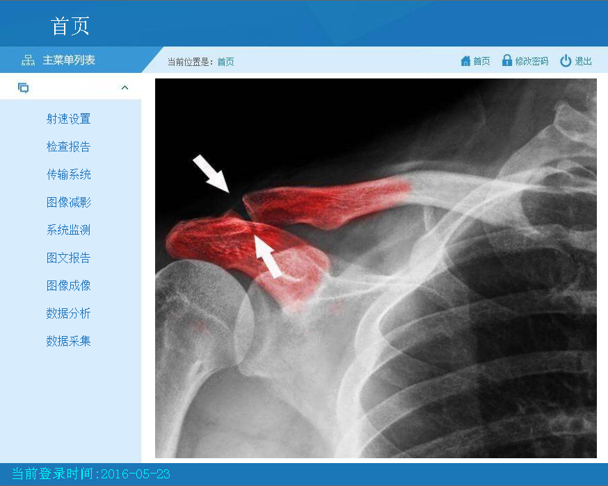

登陆成功后，进入首面，我们看到软件的诊断设置、诊断报告、传输系统、图像减影、系统监测、图文报告、图像成像、数据分析、数据采集等主要功能，点击各个功能，进行相应的操作。

诊断设置

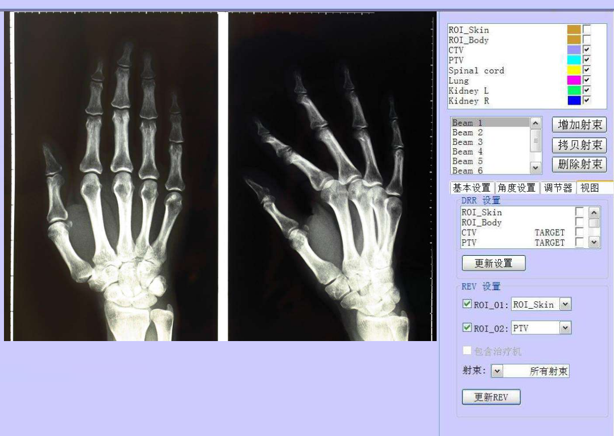

进入诊断设置页面后，我们可以点击不同的功能按钮，进行相应的操作。详细操作如下：

增加射束：点击增加射束按钮，进入增加射束页面；

拷贝射束：点击拷贝射束按钮，进入拷贝射束页面；

删除射束：点击删除射束按钮，进入删除射束页面；

基本设置：点击基本设置按钮，进行基本设置操作；

角度设置：点击角度设置按钮，进行角度设置操作；

调节器：点击调节器按钮，进行调节器操作；

视图：点击视图按钮，进行视图操作；

更新设置：设置更新设置数据；

REV设置：进行REV设置；

诊断：设置诊断；

更新REV：点击更新REV按钮，进行更新REV操作。

图像查看

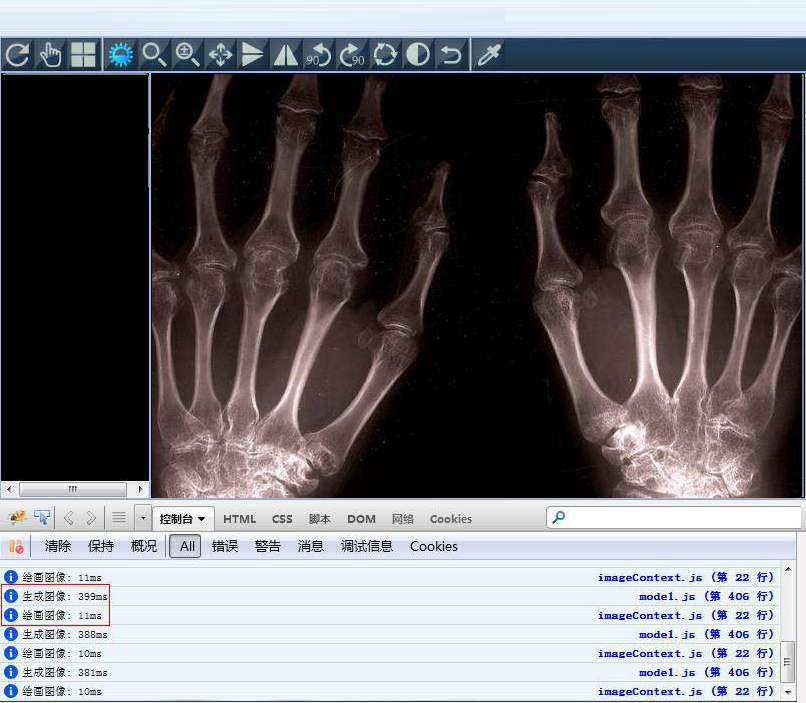

通过图像查看页面，用户可以选择不同的功能栏目，进行相应的操作。详细操作如下：

清除：点击清除按钮，清除数据；

保持：点击保持按钮，保持数据；

概况：点击概况按钮，了解概况；

AII：点击AII按钮，查看AII数据；

错误：点击错误按钮，查看错误数据；

警告：点击警告按钮，查看警告数据；

消息：点击消息按钮，查看消息数据；

调试信息：点击调试信息，查看调试信息数据。

诊断报告

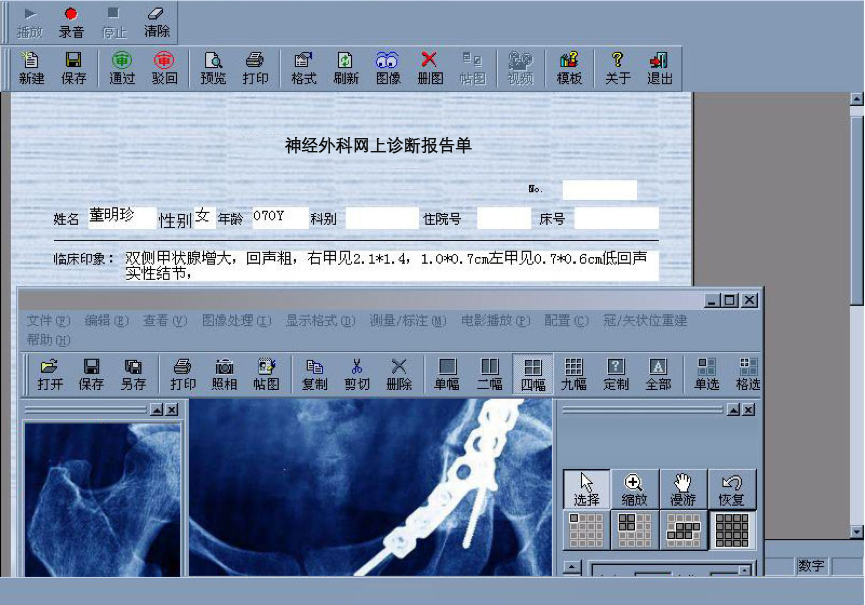

诊断报告页面包含了多个功能，用户通过多种功能来对诊断报告单进行管理操作。详细操作如下：

新建：点击新建按钮，新建诊断报告单；

保存：点击保存按钮，保存诊断报告单；

另存：点击另存按钮，另存诊断报告单；

打印：点击打印按钮，打印诊断报告单；

照相：点击照相按钮，照相诊断报告单；

删除：点击删除按钮，删除诊断报告单。

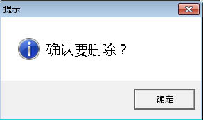

传输系统

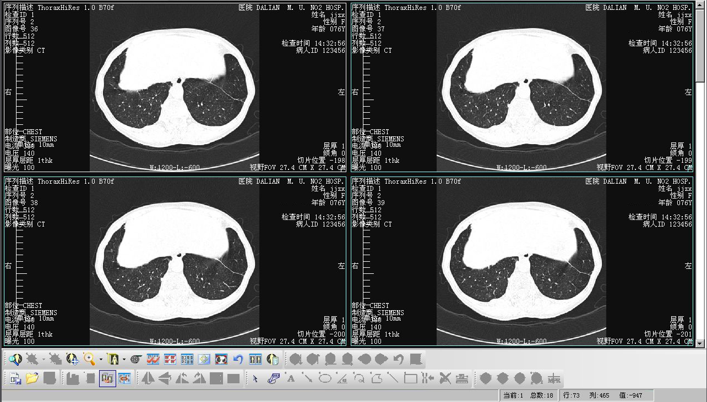

进入传输系统页面后，我们可以点击不同的功能按钮，进行相应的操作。详细操作如下：

当前传输：1；

传输总数：18；

传输行：13；

传输列：485；

传输值：-947；

信息查看：查看信息。

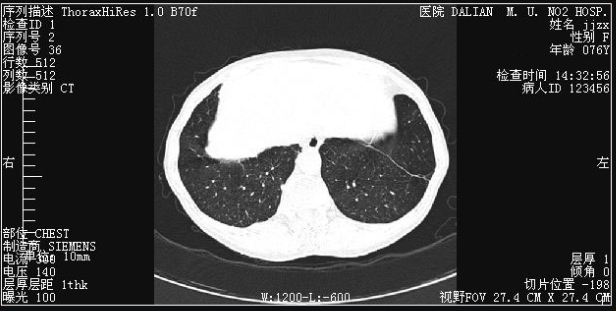

图像减影

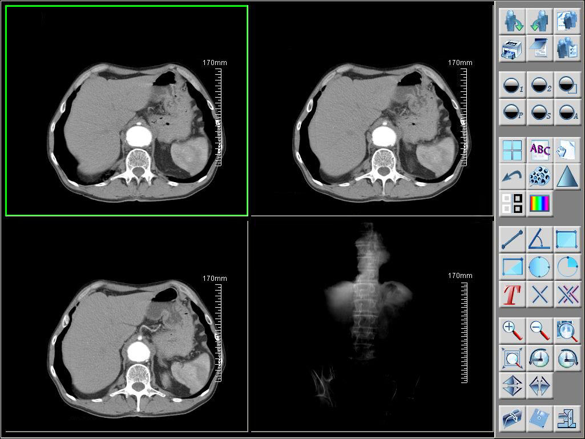

页面展示有多种功能按钮，用户可以根据需要选择功能按钮来对页面进行设置操作。详细操作如下：

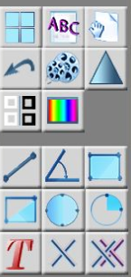

系统监测

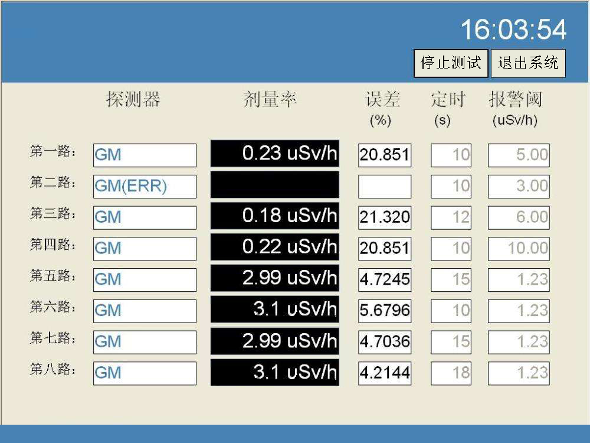

进入系统监测页面，用户可以选择探测器进行系统运行监测操作。详细操作如下：

停止测试：点击停止测试按钮，停止测试；

退出系统：点击退出系统按钮，退出系统；

探测器：查看探测路线。

图文报告

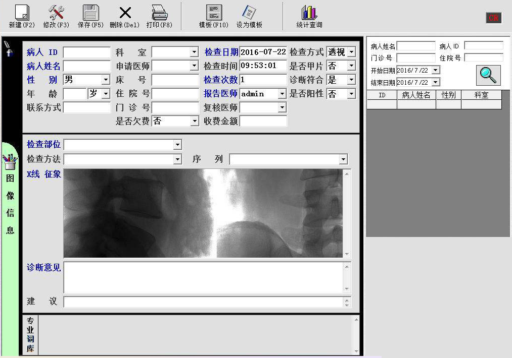

进入图文报告页面后，我们可以点击不同的功能按钮，进行相应的操作。详细操作如下：

诊断日期：2016-07-22；

诊断时间：09:53:01；

诊断次数：1；

性别：男；

诊断方式：下拉菜单选择透视；

是否甲片：下拉菜单选否；

诊断符合：下拉菜单选是；

是否阳性：下拉菜单选否；

图像信息：点击查看图像信息。

图像信息

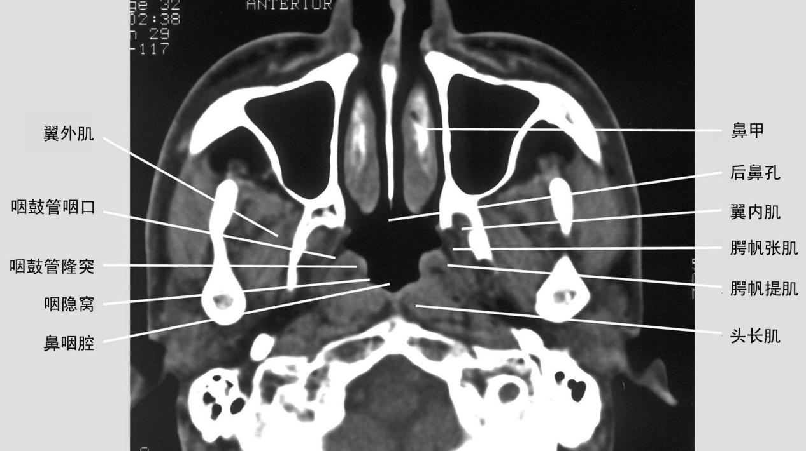

点击图文报告功能的【图像信息】子功能，进入图像信息页面。详细操作如下：

翼外肌：点击翼外肌，放大翼外肌图像；

咽鼓管咽口：点击咽鼓管咽口，放大咽鼓管咽口图像；

咽鼓管隆突：点击咽鼓管隆突，放大咽鼓管隆突图像；

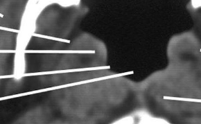

咽隐窝：点击咽隐窝，放大咽隐窝图像；

鼻咽腔：点击鼻咽腔，放大鼻咽腔图像。

打印设置

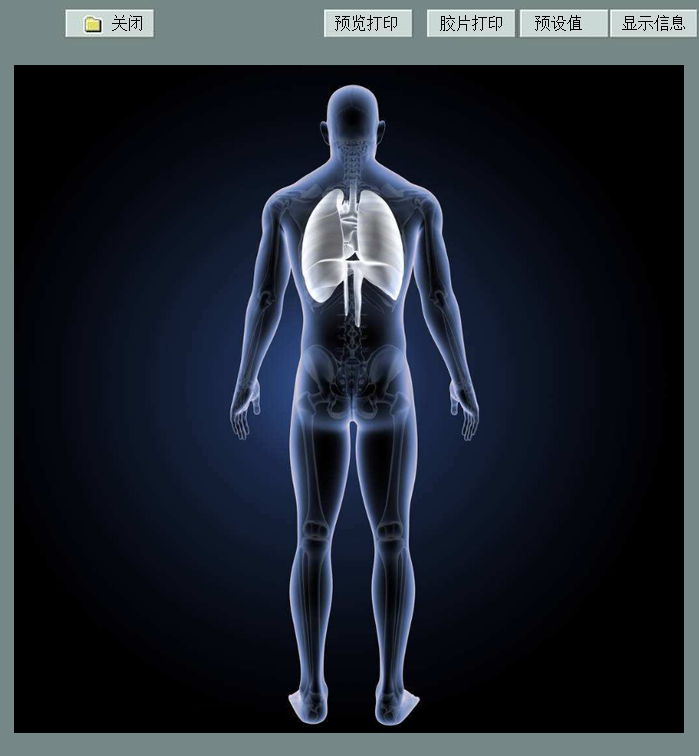

点击图文报告功能的【打印设置】子功能，进入打印设置页面。详细操作如下：

预览打印：点击预览打印按钮，预览打印；

胶片打印：点击胶片打印按钮，胶片打印；

预设值：点击预设值按钮，设置预设值；

显示信息：点击显示信息按钮，显示信息；

关闭：点击关闭按钮，关闭页面。

图像成像

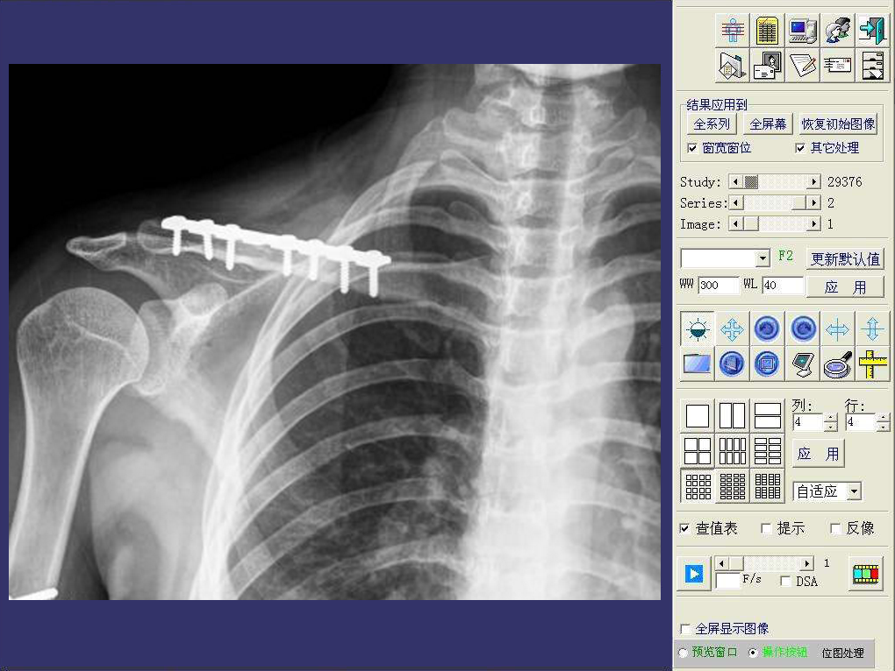

进入图像成像页面，用户可以点击不同的功能按钮，进行相应的操作。详细操作如下：

全系列：点击全系列按钮，进入全系列设置页面；

全屏幕：点击全屏幕按钮，进入全屏幕设置页面；

恢复初始图像：点击恢复初始图像按钮，进入恢复初始图像设置页面；

更新默认值：点击更新默认值按钮，进入更新默认值设置页面；

应用：点击应用按钮，进入应用设置页面；

其他设置：其他功能设置。

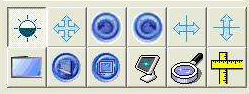

数据分析

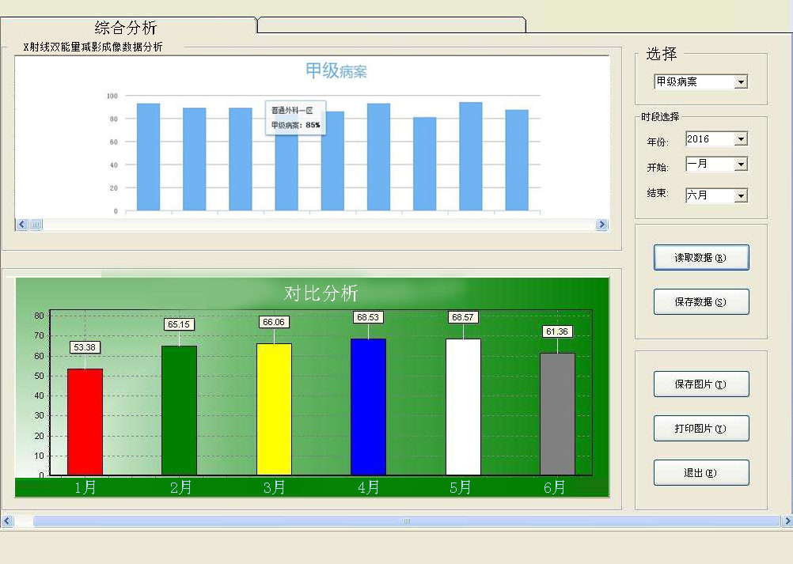

用户可以通过本界面来对RG医疗医用X射线双能量减影成像的数据进行分析查看。详细操作如下：

选择：下拉菜单选择甲级病案；

时段选择：进行时段选择操作；

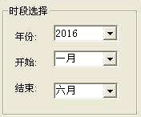

读取数据：点击读取数据按钮，读取数据；

保存数据：点击保存数据按钮，保存数据；

保存图片：点击保存图片按钮，保存图片；

打印图片：点击打印图片按钮，打印图片。

数据采集

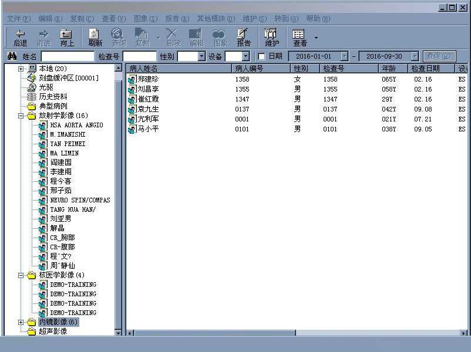

通过数据采集，用户可以通过本界面来对病人用户信息数据进行采集操作。详细操作如下：

姓名：输入姓名；

诊断号：输入诊断号；

性别：输入性别；

设备：选择设备；

数据库展示：查看数据库。
